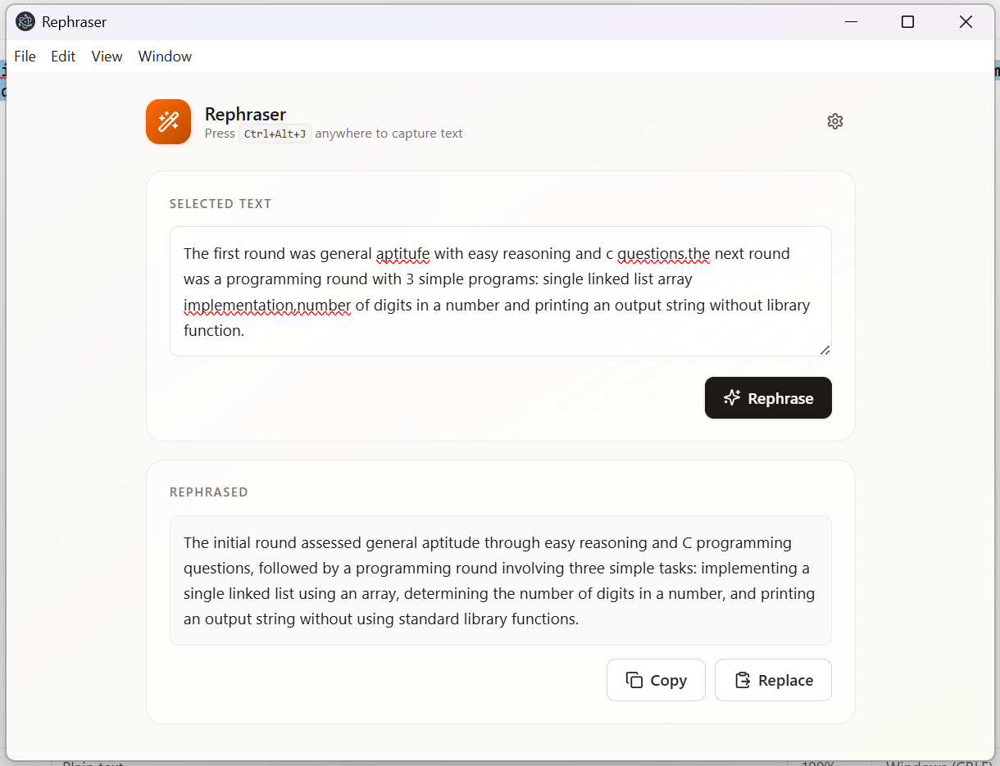
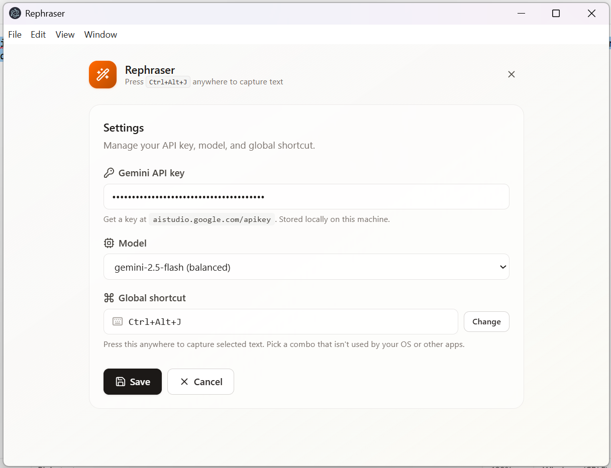
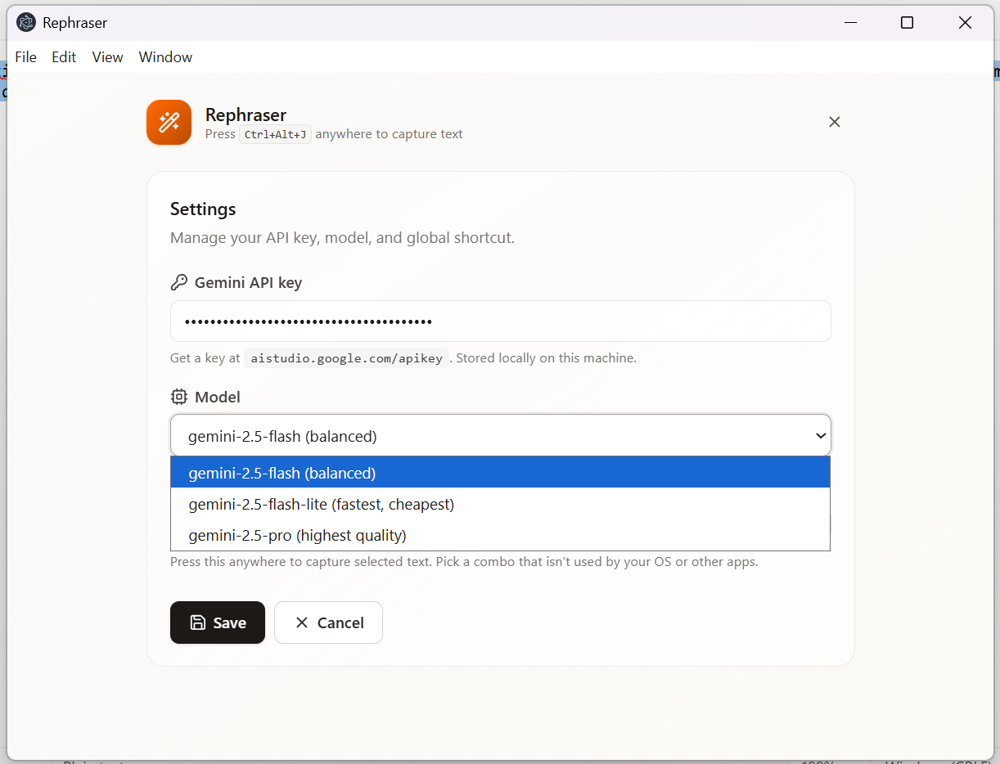
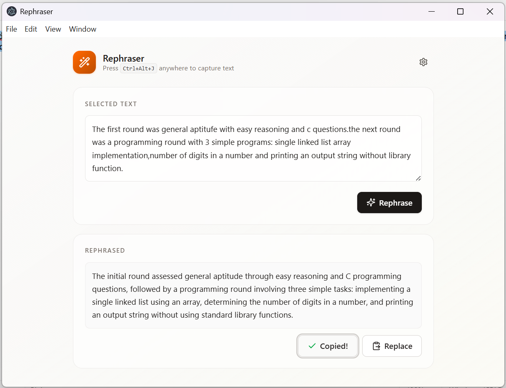

<div align="center">

# ✨ Rephraser

**Rephrase any selected text, anywhere on your computer, instantly.**

Select text in *any* app, hit a hotkey, and Rephraser turns it into a polished version using Google Gemini. One click to paste it back over the original.



</div>

---

## What it does

You're writing an email, a Slack message, a PR description, and a sentence isn't quite right. Normally you'd:

1. Cut the sentence,
2. Switch to ChatGPT/Gemini in a browser,
3. Paste it, ask for a rephrase,
4. Copy the result,
5. Switch back, paste it.

With Rephraser, you:

1. Select the text,
2. Press <kbd>Ctrl</kbd>+<kbd>Alt</kbd>+<kbd>J</kbd>,
3. Click **Rephrase** → **Replace**.

No browser. No tab switching. No context loss.

---

## Features

- 🌐 **Works in any app.** Browsers, Notepad, VS Code, Slack, Word, anywhere you can select text.
- ⚡ **Global hotkey.** Capture from anywhere with <kbd>Ctrl</kbd>+<kbd>Alt</kbd>+<kbd>J</kbd> (customizable).
- 🪄 **One-click rephrase and replace.** Pastes the new version back over your original selection.
- 🍎 **Cross-platform.** Windows (Win32 + PowerShell) and macOS (AppleScript).
- 🔒 **Local-first.** Your API key and settings live on your machine, never on a server.
- 🎨 **Choose your model.** `gemini-2.5-flash` (default), `flash-lite` (fastest), or `pro` (best quality).
- ⚙️ **Customizable shortcut** with a recorder UI and collision detection.
- 🚪 **Background-resident.** Closing the window doesn't quit the app; the shortcut keeps working.

---

## Screenshots

<table>
  <tr>
    <td align="center">
      <br/>
      <sub><b>Settings</b></sub>
    </td>
    <td align="center">
      <br/>
      <sub><b>Pick your Gemini model</b></sub>
    </td>
  </tr>
  <tr>
    <td align="center" colspan="2">
      <br/>
      <sub><b>One-click copy with feedback</b></sub>
    </td>
  </tr>
</table>

---

## Install

### Windows

1. Download `Rephraser Setup x.y.z.exe` from the [Releases page](#).
2. Double-click → follow the installer.
3. Launch Rephraser from the Start Menu.
4. On first run, paste your Gemini API key in Settings.

### macOS

1. Download `Rephraser-x.y.z-mac.zip` from the [Releases page](#).
2. Unzip → drag `Rephraser.app` into `/Applications`.
3. First launch will be blocked by Gatekeeper. Either:
   - **Right-click** the app → **Open** → **Open Anyway**, or
   - Run in Terminal:
     ```bash
     xattr -dr com.apple.quarantine /Applications/Rephraser.app
     ```
4. Launch the app. It will prompt for **Accessibility permission**. Open **System Settings → Privacy & Security → Accessibility** and toggle Rephraser on.
5. Quit and relaunch.

### Get a Gemini API key

Go to [aistudio.google.com/apikey](https://aistudio.google.com/apikey), generate a key, and paste it into Rephraser's Settings. Free tier is generous enough for personal use.

---

## How to use

1. **Select any text** in any application (browser, Notepad, VS Code, etc.).
2. Press <kbd>Ctrl</kbd>+<kbd>Alt</kbd>+<kbd>J</kbd> on Windows, or <kbd>⌘</kbd>+<kbd>⌥</kbd>+<kbd>J</kbd> on macOS.
3. The Rephraser window appears with your selected text.
4. (Optional) Edit the captured text before rephrasing.
5. Click **Rephrase**. Wait a second or two.
6. Click **Copy** to copy the new version, or **Replace** to paste it directly back over your original selection in the source app.

> 💡 **Tip:** You can also type or paste text directly into Rephraser without the hotkey. Useful when you've already cleared your clipboard.

---

## Configuration

All settings are managed inside the app. Click the ⚙ icon in the top-right.

| Setting | Description |
|---|---|
| **Gemini API key** | Your key from aistudio.google.com. Stored locally in `userData/settings.json`. |
| **Model** | `gemini-2.5-flash` (balanced, default) · `gemini-2.5-flash-lite` (fastest) · `gemini-2.5-pro` (highest quality) |
| **Global shortcut** | Click "Change" and press your desired combo. Conflicts with other apps or the OS are detected and rejected at save time. |

Settings live at:
- **Windows:** `%APPDATA%\electron-app\settings.json`
- **macOS:** `~/Library/Application Support/electron-app/settings.json`

---

## Tech stack

| Layer | Tools |
|---|---|
| **Runtime** | Electron 42, Node 20 |
| **Renderer** | React 18, TypeScript, Vite 6 |
| **Styling** | Tailwind CSS v4 (via `@tailwindcss/vite`) |
| **State** | Zustand (UI state), TanStack Query (IPC) |
| **Forms** | Formik + Yup |
| **Icons** | lucide-react |
| **Packaging** | electron-builder |
| **AI** | Google Gemini API |

---

## Troubleshooting

### Shortcut not working

Another app or the OS is holding your chosen combo. Open Settings and pick a different shortcut.

### macOS: shortcut fires but capture is empty

You haven't granted **Accessibility permission** yet. System Settings → Privacy & Security → Accessibility → toggle Rephraser on. Then quit and relaunch.

### macOS: app won't open ("can't be checked for malicious software")

Unsigned app. Right-click → **Open** → **Open Anyway**, or:

```bash
xattr -dr com.apple.quarantine /Applications/Rephraser.app
```

---

## Contributing & local development

Want to run Rephraser from source, hack on it, or build your own installer? See [CONTRIBUTING.md](./CONTRIBUTING.md).

---

## License

ISC

---

<div align="center">
<sub>Built with Electron, React, and a touch of magic. ✨</sub>
</div>
